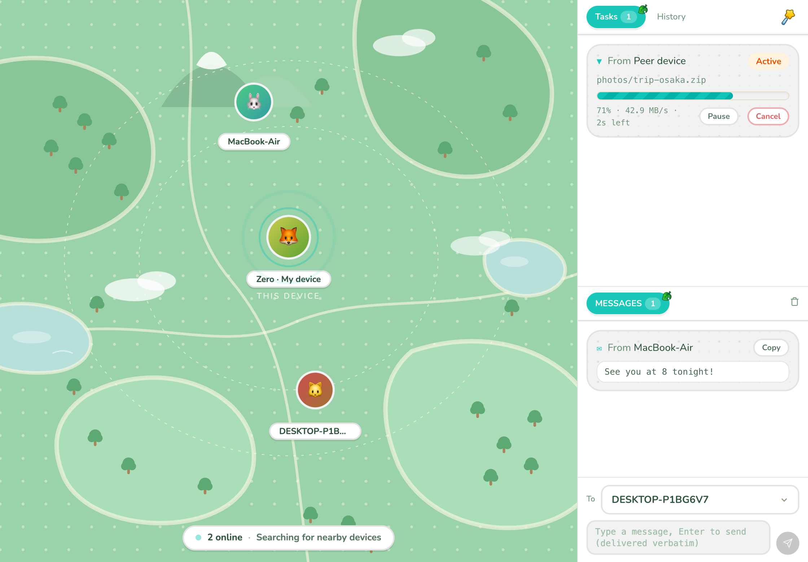
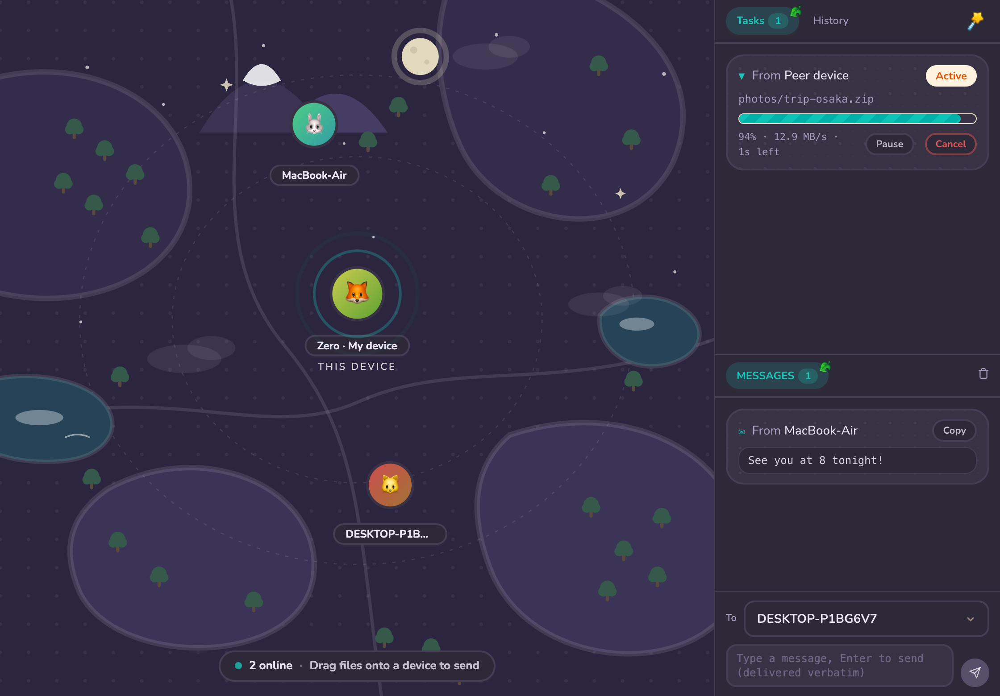

<p align="center">
  
</p>

<h1 align="center">Deskmate</h1>

<p align="center">
  LAN file & text sharing as easy as passing a note to your deskmate.
</p>

<p align="center">
  <a href="https://github.com/zlx2019/deskmate/actions/workflows/ci.yml"></a>
  <a href="https://github.com/zlx2019/deskmate/releases"></a>
  <a href="./LICENSE"></a>
  
</p>

<p align="center">
  <b>English</b> · <a href="./README.zh.md">简体中文</a>
</p>

---

Every device running Deskmate is a node on your LAN, and nodes discover each other automatically. When a node comes online it shows up as a bubble on every other node's main screen in real time — a simple drag and drop sends anything to the target node, delivered at wire speed over an end-to-end TLS 1.3 channel.

<p align="center">
  
  
</p>

## ✨ Features

- 🌐 **LAN P2P** — devices on the same LAN discover each other; going online/offline updates in real time.
- 🖱️ **Dead-simple sending** — drag files or folders onto a device avatar; the transfer starts once the receiver confirms.
- ⏯️ **Transfer control** — pause / resume / cancel from either side, live speed and ETA.
- 🔁 **Resumable transfers** — unexpected disconnects keep partial data; one click resumes from the exact byte offset, verified by whole-file BLAKE3.
- 📋 **Clipboard sync** — received text can land on the clipboard automatically, sharing in one click.
- 🔐 **Data security** — TLS 1.3 mutual auth with certificate-pinned identities, optional pairing PIN with brute-force throttling, per-device trust list for auto-accept.
- 🌗 **Themes** — a light teal-grassland style, plus a dark starry-night style.
- 🎨 **Personalizable** — emoji or custom image avatars, display name, and a panel background color of your choice.
- 🖥️ **Desktop-native** — system tray residence, notifications, autostart, single-instance lock, transfer history.
- 🪶 **Lightweight** — Tauri 2 + Rust; the installer stays under 10 MB.

## 📥 Install

Grab the installer for your platform from [Releases](https://github.com/zlx2019/deskmate/releases):

| Platform | Artifact |
|---|---|
| macOS (Apple Silicon / Intel) | `Deskmate_x.y.z_aarch64.dmg` / `Deskmate_x.y.z_x64.dmg` |
| Windows | `Deskmate_x.y.z_x64-setup.exe` (NSIS; registers the firewall rule for you) |
| Linux | `Deskmate_x.y.z_amd64.AppImage` / `.deb` |

> Builds are currently unsigned. On macOS, right-click the app and choose **Open** the first time (or run `xattr -cr /Applications/Deskmate.app`). Windows SmartScreen may ask for confirmation as well.

## 🔨 Develop

Prerequisites: **Rust ≥ 1.96**, **Node ≥ 22**, **pnpm**. On Linux you also need the Tauri system packages (`libwebkit2gtk-4.1-dev`, `libayatana-appindicator3-dev`, `librsvg2-dev`, ...).

```bash
git clone https://github.com/zlx2019/deskmate.git
cd deskmate/apps/desktop
pnpm install
pnpm tauri dev     # run the desktop app with hot reload
pnpm tauri build   # produce installers for the current platform
```

The engine is a UI-free Rust library (`crates/deskmate-core`) shared by the desktop app and a CLI (`crates/deskmate-cli`) that is handy for protocol debugging:

```bash
cargo run -p deskmate-cli -- listen    # act as a receiver
cargo run -p deskmate-cli -- scan     # list nearby devices
cargo nextest run --workspace         # run the test suite
```

## ❓ FAQ

**macOS says the app is damaged / from an unidentified developer.**
The build is not notarized yet. Right-click → Open once, or clear the quarantine flag with `xattr -cr /Applications/Deskmate.app`.

**Devices never show up on macOS.**
macOS 15+ asks for **Local Network** permission on first launch — it must be allowed, otherwise discovery fails silently. Re-enable it under System Settings → Privacy & Security → Local Network.

**Devices never show up on Windows.**
Discovery needs an inbound firewall rule. The NSIS installer registers it automatically; if you run a portable binary instead, allow `Deskmate.exe` for private networks when Windows asks.

**Why a custom TCP protocol instead of HTTP?**
On a LAN (sub-millisecond RTT, ~zero loss) HTTP adds ceremony without benefits, and precise pause/resume/cancel semantics are much cleaner over a framed TCP + TLS channel. See the rationale in [docs/PLAN.md](./docs/PLAN.md).

**Which Linux runtime libraries are required?**
`webkit2gtk-4.1` and `libayatana-appindicator3` — the `.deb` declares them; the AppImage ships them inside.

## 📄 License

[MIT](./LICENSE)

The UI is built with [animal-island-ui](https://github.com/guokaigdg/animal-island-ui), which is licensed under [CC BY-NC 4.0](https://creativecommons.org/licenses/by-nc/4.0/) (non-commercial). If you plan to use Deskmate commercially, replace this component library first.
